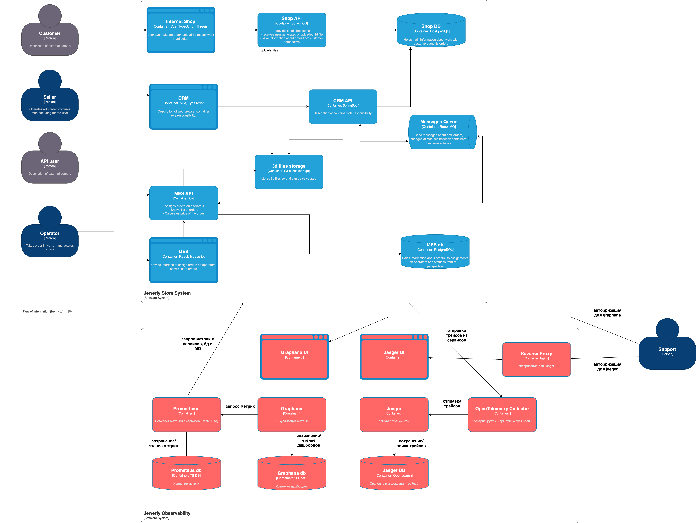

# Архитектурное решение по трейсингу

## Мотивация
Трейсинг необходим компании, для повышения наблюдаемости и возможности анализа системы

Причины перехода:

1) трейсинг поможет отслеидить путь перехода заказа по статусам => отследим, какая система теряет заказы
2) сможем проанализировать, сколько времени занимает каждая фаза заказа
3) сможем отследить, сколько заявка ожидает обработки менеджером и оператором производства
4) сможем отследить, на каком этапе возникла ошибка
5) за счет передачи трейсов по rabbitmq сможет отслеживать, сколько заказ "висит" в очереди

## Предлагаемое решение

Трейсинг будет реализован с помощью Open Telemetry

План настройки:

1) Добавить в код приложений SHOP, MES, CRM отправку спанов через OTLP
2) Поднять OpenTelemetry коннектор приложение в кластере метрик для получения трейсов
3) Поднять Jaeger для хранения трейсов и их отслеживания через UI
4) Настроить аутентификацию в Jaeger

## Компромисы
Трейсинг можно не включать для расчета 3d модели, например стартовать span только после того как модель сформирована

## Аспекты безопасности
В трейсах нельзя публиковать чувствительные данные, номера заказа будет достаточно.
Доступ к трейсингу будет осуществляться с авторизацией во внутренней сети и будет разрешен только сотрудникам поддержки.
Также в Jaeger нет встроенной авторизации, поэтому необходимо использовать reverse proxy на nginx с авторизацией на нем