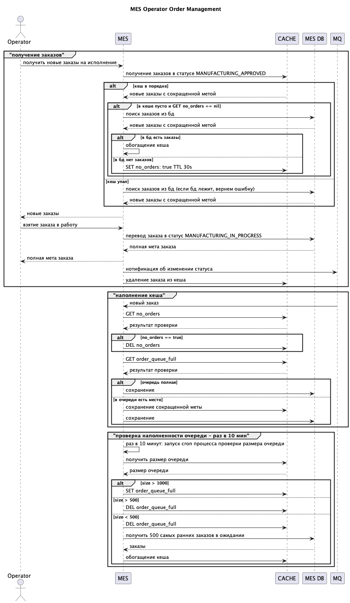

# Архитектурное решение по кешированию

## Мотивация
Операторы долго ждут загрузки страницы с заказами, им нужно оперативно получать информацию о новых заказах, чтобы брать их в работу.

## Предлагаемое решение

UI для операторов должен отражать
1) Заказы в статусе  MANUFACTURING_APPROVED - их можно брать в работу
2) Заказы в статусе MANUFACTURING_COMPLETED - их можно упаковывать и отправлять в службу доставки

Заказы должны быть отсортированы по дате поступления

Предлагается использовать паттерн **Refresh Ahead**

заказы поступают в MES в статусе  MANUFACTURING_APPROVED/MANUFACTURING_COMPLETED через MQ и их сокращенная мета помещается в кеш. 

Процесс работы с кешом описан в sequence диаграмме:

### Сравнение стратегий кеширования

|стратегия|преимущества|недостатки|
|---|---|---|
Cache-Aside| меньше нагрузка на базу | при сопоставимой скорости поступления заказов, будет постоянная нагрузка на базу, так как операторы будут брать в работу заказы, только что попавшие в кеш
Read-Through| меньше нагрузка на базу | тот же минус, что и у предыдущего пункта
Refresh-Ahead|если скорость поступления заказов превышает скорость работы операторов, кеш будет расти => надо придумывать систему вытеснения | новые заказы уже в кеше => нет большой нагрузки на базу
Write-Through | новые заказы уже в кеше, но есть та же проблема, что в предыдущем пункте | **при падении кеша, заказ может потеряться**

### Решение

#### Refresh-Ahead с обогащением из MQ

1) Для обогащения кеша используем MQ с заказами: 
заказ из MQ пишем и в базу (полная мета) и в кеш (сокращенная мета)
1) Операторы получают заказы из кеша используя статус в качестве ключа
2) Кеш ограничен - максимум 1000 заказов
3) Если приходит новый заказ, а в кеше уже >= 1000 заказов, сохранеям его только в базу, при этом ставим доп флаг в кеш, что очередь полна
4) Есть асинхронное обогащение кеша из базы, чтобы старые заказы не вытеснялись новыми
5) Есть fallback в базу при недоступности кеша или если кеш пуст: см [sequence диаграмму](operator-orders-sequence.puml)
